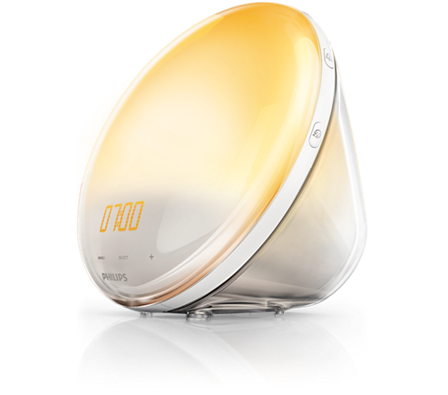
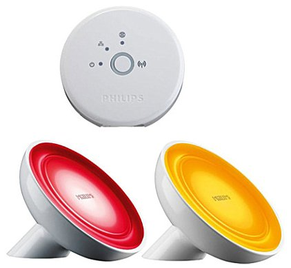
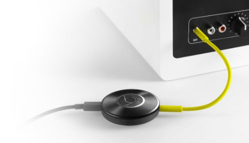
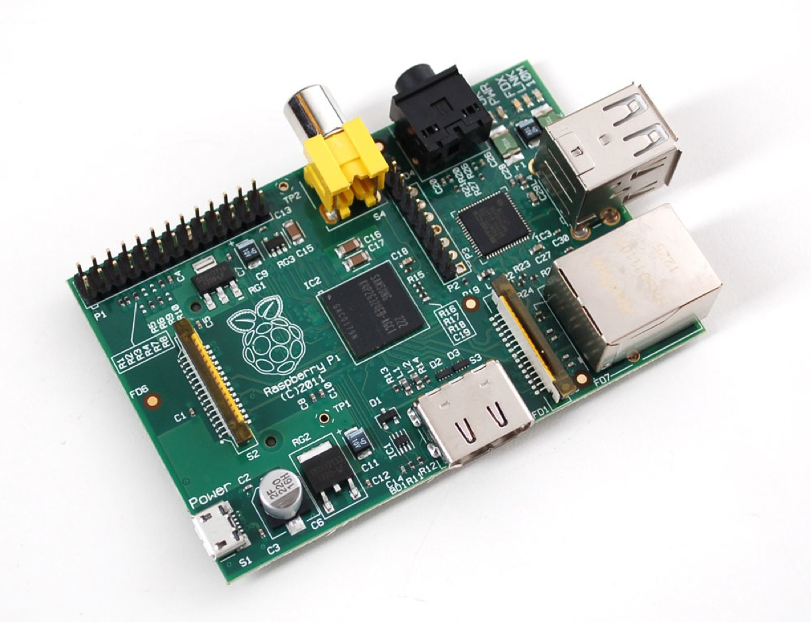
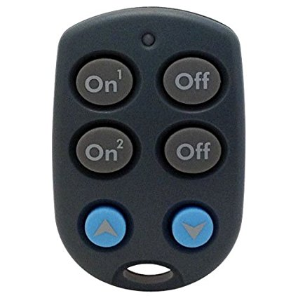
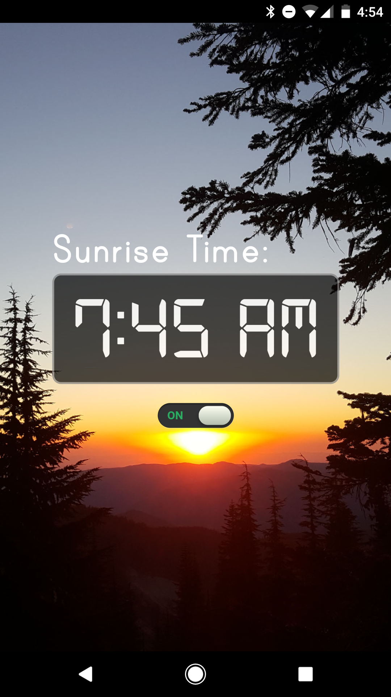
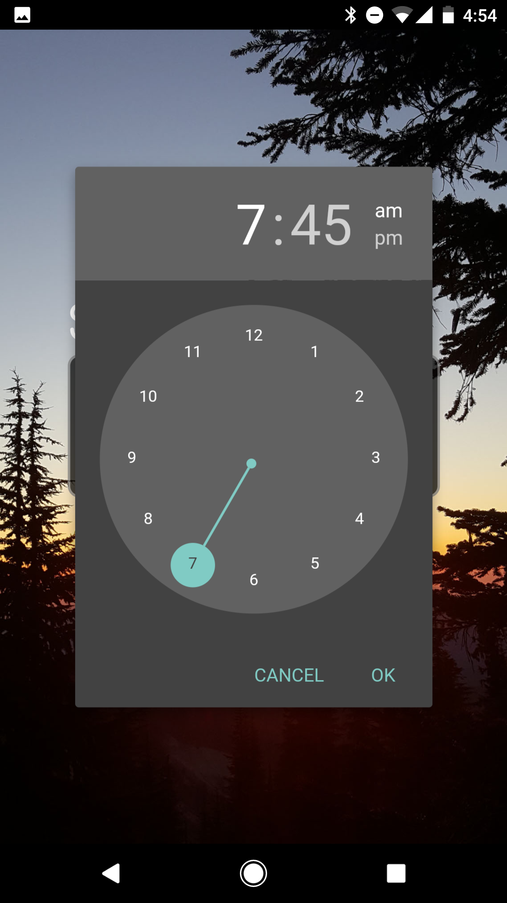

# Introduction: Sunrise (a wake up alarm with light and sound)
A wakeup alarm to replicate the functionality of one of the Philips Wake Up lights, which has the ability to wake you up with gradually increasing light and sounds. Cool idea, but bad execution. See why at my [blog post](https://m4rc.us/).



We'll use a bunch of cheap/old things, since I already own them. If you're here you probably already own them too.

* A Philips Gen 1 Bridge and Bloom Starter Kit: custom-color lights to fade in (could use any Hue lights)   
  

* A Chromecast Audio: hooked up to speakers in the bedroom to play wake up sounds  
  

* A Raspberry Pi 1 Model B: to host the app and communicate with the Chromecast/Hue APIs  
  

* And some X10 hardware, a CM19A USB tranciever and some KR19A remotes:   
  (**Optional**, used to easily turn on/off lights and audio without a phone after waking up)  
  

This project includes a Node app that runs on the Raspberry Pi to handle scheduling and executing the wake up routine which slowly fades in the sunrise-colored lights while playing the sounds of birds chirping and waves crashing.

# Usage

## Web App with Add-to-Homescreen

With the bookmark on your home screen, it's easy to turn on and off or change the time of the alarm:




At the time of the alarm, the lights will fade in and the sounds of birds chirping plays on your speakers to gradually wake you up refreshed!

# Setup

## Hue Light Configuration

### Use the Hue app to make a scene

* In the [Philips Hue app](https://play.google.com/store/apps/details?id=com.philips.lighting.hue2), under Settings > Room setup, create a room (aka "group") with the lights you want to wake up with
* In the app, under "Home", tap on the room you created and set the lights to the colors you want them to wake up with, then set the lights to the _lowest possible brightness_ (we'll gradually brighten them later). Finally, under the "Scenes" tab, tap the "+" to create a new scene with "Current Light settings"

### Use the Hue Bridge API to get an API Key and the IDs of the group and scene

* Find the IP Address of your bridge and visit the debug website in your browser: `http://[bridge ip]/debug/clip.html`
* Create an API Key using the `newdeveloper` API - see the [Documentation](https://developers.meethue.com/documentation/getting-started) for how to do this
* Find the ID of the group you created by using the groups API in the debug website: GET `/api/[apikey]/groups`. You'll need this later.
* Find the ID of the scene you created by using the scenes API: GET `/api/[apikey]/scenes`. You'll need this later.

## Raspberry Pi Install & Configuration

### Prerequisites

* A Raspberry Pi with Jessie installed
* git: `sudo apt-get install git`
* node v4+: `wget http://node-arm.herokuapp.com/node_latest_armhf.deb` then `sudo dpkg -i node_latest_armhf.deb`

### Get the code 

SSH into your Pi, then in the `pi` user home directory (`/home/pi`) get the app code and scripts via git:
```bash
git clone https://github.com/Marcus-L/sunrise.git sunrise
```

Get the `stream2chromecast` python scripts for controlling the chromecast: (and install python if you don't have it already)
```bash
git clone https://github.com/Pat-Carter/stream2chromecast.git sunrise/scripts/stream2chromecast
sudo apt-get install python
```

## Install the app

Install the app as a service using `forever-service` so it automatically starts up every time your Pi reboots

```bash
cd sunrise/app
npm install
sudo npm install -g forever forever-service 
sudo forever-service install sunrise --script bin/www
sudo /etc/init.d/sunrise start
cd ../..
```

Test out the app from your phone at `http://[raspberry ip address]:3000`, add it to your homescreen!


## Set up the wake up script

Edit the `sunrise/scripts/do_sunrise` file:

```bash
#!/bin/bash

## SET THIS WITH YOUR HUE BRIDGE URL
API='http://192.168.5.148/api/s6Mkw2cc477nLQ9wD42A5SOYJYspvKN8LQshpy5A'
JSON='Content-Type: application/json' 
curl -H "$JSON" -X PUT -d '{"scene": "vR3UvWS7Rvgs1i2"}' $API/groups/1/action ## SET GROUP AND SCENE
curl -H "$JSON" -X PUT -d '{"bri": 254, "transitiontime": 3000}' $API/groups/1/action ## SET GROUP
/home/pi/sunrise/scripts/playmp3 /home/pi/sunrise/scripts/wakeup.mp3
```
* Set the Hue Bridge API URL with your info (`http://[bridge ip]/api/[api key]`)
* Set the Scene ID to start the sunrise (example: `vR3UvWS7Rvgs1i2`)
* Set the Group ID for the lights you want to turn on (example: `1`)
* Optional: change the transition time if you want them to fade in faster or slower. `3000` is 300 seconds (5 minutes). Swap out the wakeup mp3 file to use different wake up sounds.

## Set up X10 if you have some remotes (Optional)

Install `mochad`, which handles the USB X10 RF tranciever.
```bash
sudo apt-get install libusb-1.0-0-dev
wget -O mochad.tgz https://sourceforge.net/projects/mochad/files/mochad-0.1.17.tar.gz/download 
tar xvf mochad.tgz
cd mochad-0.1.17
./configure
make
sudo make install
cd ..
rm mochad.tgz
sudo systemctl start mochad.service
sudo systemctl daemon-reload
```

Edit the `scripts/x10listen.sh` file. This sample is set up to set the bright/dim buttons to stop the audio playing, and the A2 On/Off buttons to turn the Hue light group on and off. If you already have X10 lights you'll probably want to customize this.
```bash
#!/bin/bash

## CHANGE THIS TO YOUR HUE BRIDGE URL (use your ip address and API Key)
API='http://192.168.5.148/api/s6Mkw2cc477nLQ9wD42A5SOYJYspvKN8LQshpy5A'
JSON='Content-Type: application/json'
netcat -d localhost 1099 | while read line
do
    match=$(echo $line | grep -c -i -E 'Bright|Dim') ## SET REMOTE KEY
    if [ $match -eq 1 ]; then
        ## CHANGE THE DEVICE NAME FROM "Bedroom" 
        /home/pi/sunrise/scripts/stream2chromecast-master/stream2chromecast.py -devicename "Bedroom" -stop 
    fi

    match=$(echo $line | grep -c -i -E 'A2 Func: On') ## SET REMOTE KEY
    if [ $match -eq 1 ]; then
        curl -H "$JSON" -X PUT -d '{"on": true}' $API/groups/1/action ## SET GROUP
    fi

    match=$(echo $line | grep -c -i -E 'A2 Func: Off') ## SET REMOTE KEY
    if [ $match -eq 1 ]; then
        curl -H "$JSON" -X PUT -d '{"on": false}' $API/groups/1/action ## SET GROUP
    fi
done
```
* Set the Hue Bridge API URL with your info (`http://[bridge ip]/api/[api key]`)
* Set the Chromecast device name (`Bedroom`) you are playing the wakeup sounds on
* Set the X10 remote key (`A2 On, A2 Off, Bright/Dim, etc`) you want to use to control things
* Set the group ID for the lights you want to control

Install the x10listen service and start it:

```bash
sudo mv sunrise/scripts/x10listen /etc/init.d
sudo update-rc.d x10listen defaults
sudo /etc/init.d/x10listen start
```

# Thanks!

* [Philips](https://developers.meethue.com/philips-hue-api) for having a great open API on their Hue bridge & lights and nice documentation
* [mochad](https://github.com/SensorFlare/mochad) for working with X10 devices like a champ
* [stream2chromecast](https://github.com/Pat-Carter/stream2chromecast) for the easy API to play music on Chromecasts
* [fontspace.com](http://www.fontspace.com/) for the [Digital-7](http://www.fontspace.com/style-7/digital-7) and [Print Clearly](http://www.fontspace.com/blue-vinyl/print-clearly) fonts
* [Brad's Codepen](https://codepen.io/bbodine1/pen/novBm) for the On/Off slider CSS style
* [paper-time-picker](https://github.com/bendavis78/paper-time-picker) for the material design time picker